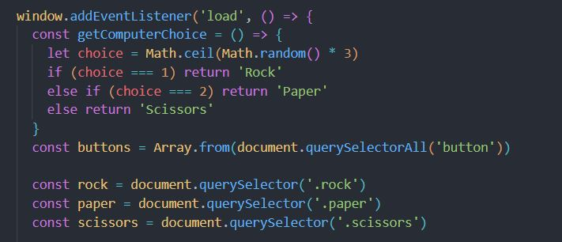

# Rock-Paper-Scissors-TOP

Adaptation of <a href="https://github.com/hroglardev/Rock-Paper-Scissors-TOP-Console" target="_blank">my original console game</a> developped for the odin project. This version is played through UI instead of console.

# What the project is about

This project is supposed to simulate a game of Rock, Paper Scissors against a computer.

# What have I learned so far?

In this project I started implementing the basics of DOM manipulation to make an interactive website.
Below you can read what new concepts I implemented during this project.

<ul>
  <li>Creation and modification of DOM elements.</li>
  <li>Implementation of event handlers to interact with user. </li>
  <li>Use of timeouts to delay some interactions.</li>
</ul>

# Explanation of the code

The code initialises by using an event telling the DOM to wait for the scripts to load before allowing interaction from the user, after which we find an arrow function.

This function's purpose is to simulate a computer choice of Rock, Paper or Scissors by generating a random number between 1 and 3 and returning a string which depends on the number generated.
1 will result in Rock being chosen, two will result in Paper and 3 will result in Scissors.

After this, elements from the DOM are saved into constants.

The reason why Array.from() is used, is because the querySelectorAll method, results in a nodelist, not an array.

This function simulates a round of Rock, Paper, Scissors by stipulating what to do in any of the possible outcomes.

In case of not tieing the round, the function will do three things:

<ul>
  <li>First it will add the class "filter" to the elements of the DOM that represent the two possible choices the user did not select.</li>
  <li>Second it removes the same class from the same elements after one second.</li>
  <li>Last, it returns a string informing what the result of the round was.</li>
</ul>

This part of the code declares two variables to keep track of the score, and saves into constants multiple DOM elements.

After this we find another function which handles the resetting of the game once either the pc or the user reaches 5 points.

<ul>
  <li>It resets both scores to 0.</li>
  <li>It changes the text of some DOM elements.</li>
  <li>It removes the reset button from the DOM.</li>
  <li>It reenables the choice buttons for user interaction.</li>
</ul>

This section sets up the reset button by creating it, setting up its text and classes for styling and giving it a function to execute in the event of clicking it. (The function is the one we declared right before this section).

This is where all the game is basically played.

<ol>
  <li>It iterates over the array of buttons that we previously saved into the "buttons" constant with the Array.from() method.</li>
  <li>At each iteration it adds a click event to each button.</li>
  <li>When a button is clicked, a round is played by calling the playRound function (and saving the result in a variable) and passing as parameters the text from the button that was clicked, and the return value of the getComputerChoice function.</li>
  <li>If the result has the phrase "You win" in it, the user's score increases by one. We also change the message to whatever the return value was for the result. Lastly, it modifies the text of the element in the DOM that displays the user's score.</li>
  <li>If, on the other hand, it was the PC that won the round. The same functionality is achieved but instead is applied on the computer's score instead of the user's.</li>
  <li>If it's neither of those cases, the only possible result it's a tie, in which case only the message informing so changes.</li>
  <li>Lastly, if either player reaches 5 points, the function inserts a button into the DOM to reset the game using the resetGame function. It displays a message informing who won the game and lastly it disables the buttons for playing unless the user decides to replay.</li>
</ol>

# Want to see it in action?

<a href="https://hroglardev.github.io/Rock-Paper-Scissors-TOP/" target="_blank">Click here for app</a>

# Want to track my progress?

Checkout my other projects in order to see my evolution:

<ol>
  <li><a href="https://github.com/hroglardev/odin-recipes" target="_blank">Recipes</a></li>
  <li><a href="https://github.com/hroglardev/Odin-landing-page" target="_blank">Landing Page</a></li>
  <li><a href="https://github.com/hroglardev/Rock-Paper-Scissors-TOP-Console" target="_blank">Console Rock, Paper, Scissors</a></li>
  <li><a href="https://github.com/hroglardev/Rock-Paper-Scissors-TOP" target="_blank">You are here</a></li>
</ol>
